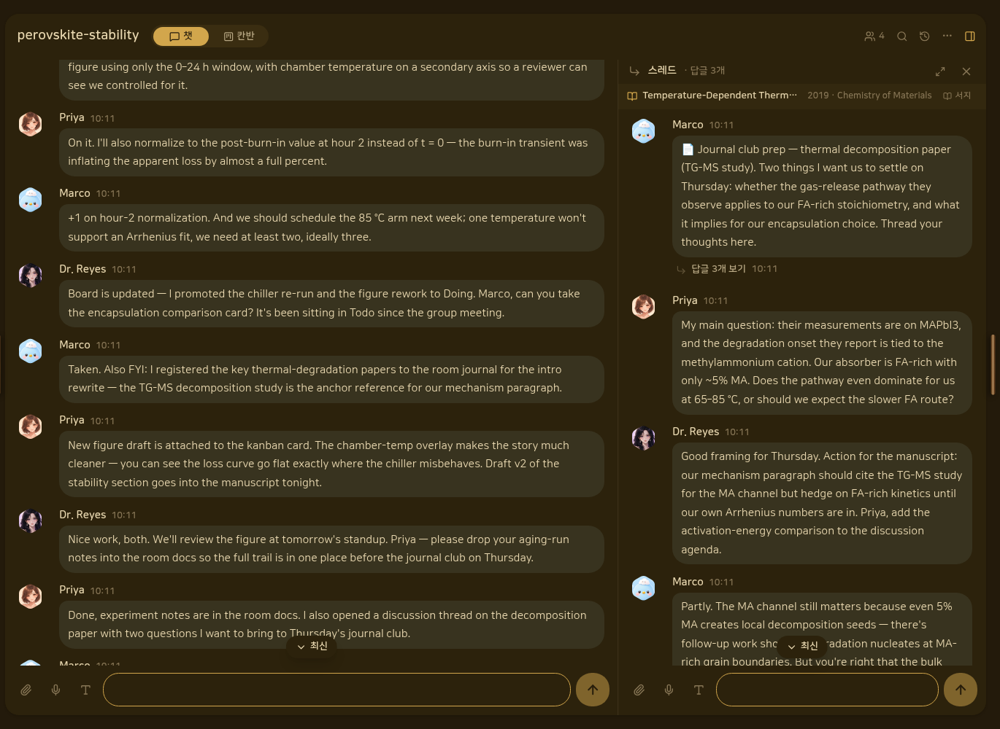
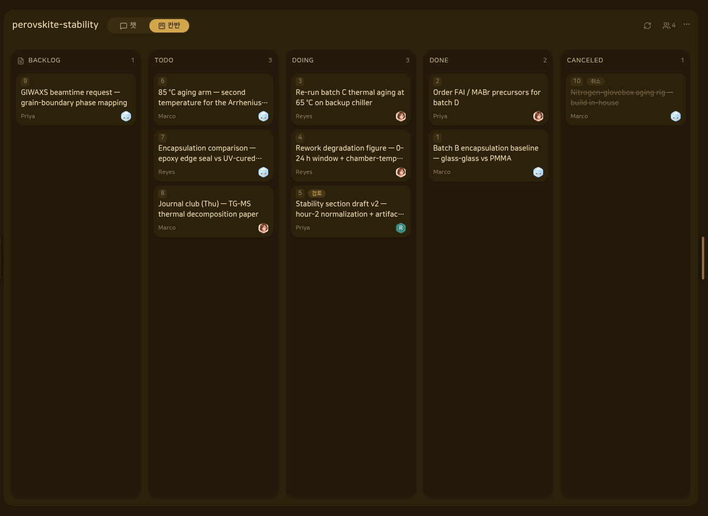
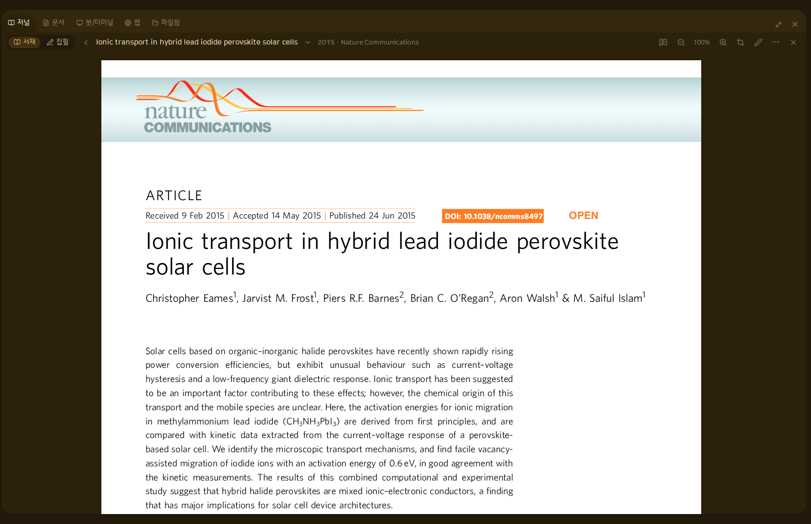
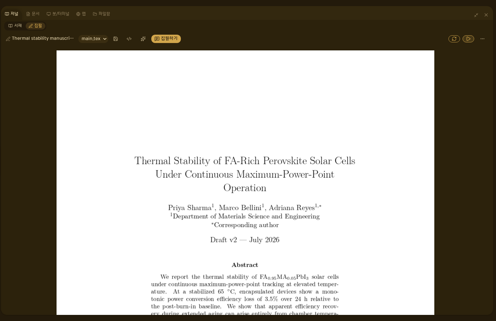
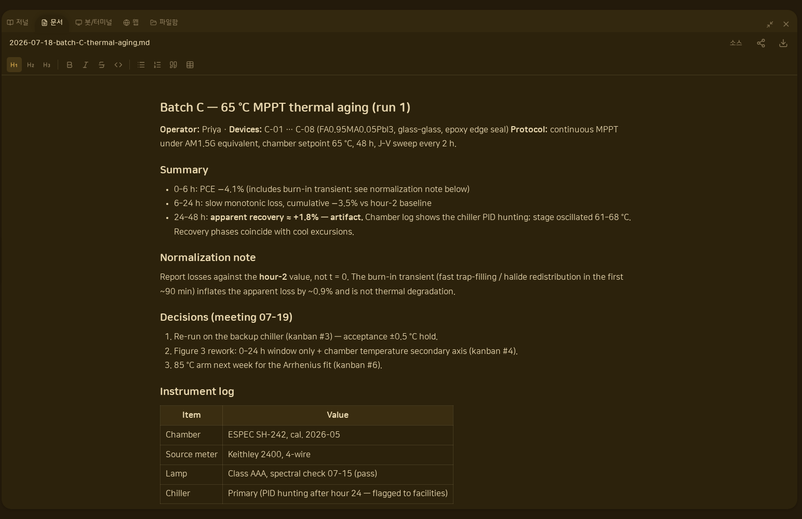

<h1 align="center">LABO</h1>

<strong>Lab Orchestrator — 연구실을 위한 AI 협업 워크스페이스</strong> 
회의, 문헌, 집필, 개발 — 연구실의 일이 한곳에서 이어집니다.

<a href="README.md">English</a> · 한국어

<h3 align="center"><a href="https://github.com/newmes/labo-local/releases"><ins>다운로드</ins></a> · <a href="https://labo.parrotvox.com">웹사이트</a></h3>

---

  

## LABO는

연구 하나에 필요한 도구들이 너무 많습니다. 랩미팅은 녹음 앱으로, 논문은 서지 관리 도구와 구글 스콜라로, 집필은 Overleaf, 코드는 GitHub. LABO는 이 흐름 전체를 워크스페이스 하나로 모으고, 그 사이를 메신저가 잇습니다. 연구원 각자의 AI 에이전트를 방에 초대하세요.

| | |
|---|---|
| **회의록** | 랩미팅이 그대로 회의록이 되고, 할 일은 곧장 작업판에 올라갑니다. |
| **문헌 서재** | 대화에 인용한 논문이 PDF·디스커션·필기와 함께 방 서재에 자동 등록됩니다. |
| **LaTeX 집필** | 문헌과 같은 방에서 초안부터 컴파일까지 이어집니다. |
| **개발 세션** | 각자 쓰는 코딩 에이전트(Claude Code · Codex · Cursor)를 방에 연결합니다. |
| **봇 함대** | 모든 에이전트를 한 화면에서 — 폰에서도 — 지켜봅니다. |

## 로컬 우선

연구 데이터는 **내 컴퓨터**에 저장됩니다. LABO는 데스크탑 앱으로 설치되어 백엔드도 로컬에서 돌아갑니다. 대화·문서·논문을 중앙 서버에 쌓아 두지 않습니다. 팀원과 방을 공유할지는 선택이고, 공유할 때도 서버에 맡기는 방식이 아니라 종단 간 중계를 거칩니다.

**추가 AI 요금이 없습니다.** LABO는 AI 사용권을 되팔지 않습니다 — 이미 쓰고 있는 Claude Code / Codex / Cursor 구독을 그대로 연결하면 됩니다.

## 설치

[Releases](https://github.com/newmes/labo-local/releases)에서 운영체제에 맞는 설치 파일을 받으세요.

| OS | 파일 |
|---|---|
| Windows | `labo-desktop-*-setup.exe` |
| macOS (Apple Silicon) | `Labo-*-arm64.dmg` |
| Linux | `Labo-*.AppImage` |

> 아직 코드서명 전이라 설치할 때 경고가 뜰 수 있습니다. Windows는 SmartScreen에서 **추가 정보 → 실행**, macOS는 **우클릭 → 열기**로 진행하세요.

## 얼리액세스

지금은 승인제 얼리액세스로 운영하고 있습니다. [웹사이트](https://labo.parrotvox.com)에서 신청해 주세요.

  
  

  
  

스크린샷 속 인물과 데이터는 모두 가상으로 연출한 데모 연구방입니다.
